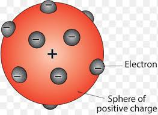
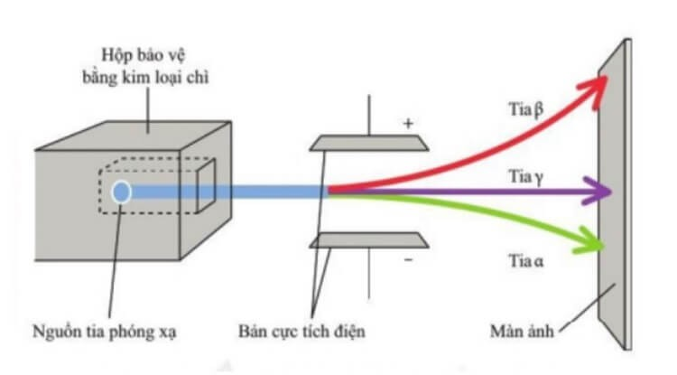

## 1897: Thompson phát hiện ra electron:
background-color:: red
	- Trước đó, người ta biết rằng nguyên tử trung hòa về điện. Điều này có nghĩa là phải tồn tại các hạt mang điện tích dương để cân bằng với các electron mang điện tích âm.
	- Sau phát hiện này, Thomson đã đưa ra mô hình nguyên tử, được gọi là "mô hình bánh pudding":
		- + Nguyên tử là một khối cầu đặc chứa đầy điện tích dương.
		- + Các electron phân bố đều bên trong khối cầu, giống như các hạt nho rải đều trong một chiếc bánh pudding.
		- {:height 199, :width 263}
	- Sự tách các tia phóng xạ:
		- Đây là thí nghiệm chứng minh sự khác biệt giữa các loại tia phóng xạ α, β, γ thông qua việc quan sát sự lệch hướng của chúng trong điện trường
		- {:height 364, :width 644}
	- Nhận xét thí nghiệm:
		- Tia α:
			- + Bị lệch về hướng của bản cực tích điện âm => mang điện tích dương
			- + Góc lệch hướng bé hơn so với tia β => khối lượng nặng hơn tia β
			- + Là hạt nhân ${}^{4}_{2}\text{He}$
		- Tia β:
			- + Bị lệch về hướng của bạn cực điện tích dương => mang điện tích âm
			- + Là electron
		- Tia γ:
			- Không bị lệch => Tia γ không mang điện tích
			- Là sóng điện từ
		-
- ## 1911: Thí nghiệm tìm sự có mặt của hạt nhân (+) của Rutherford
  background-color:: red
-