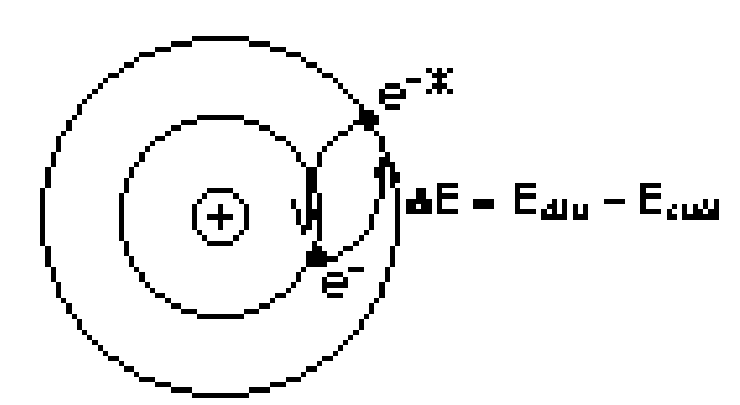
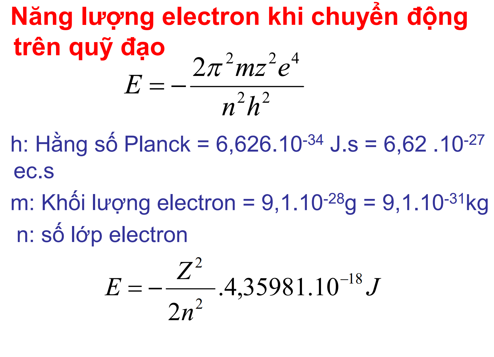
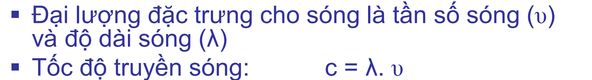
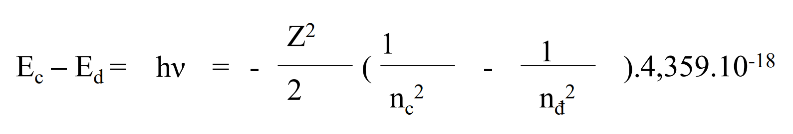

# Mô hình nguyên tử Bohr
background-color:: red
	- + Electron chuyển động theo các đường tròn đồng tâm (có bán kính xác định)
	- + Năng lượng Electron bảo toàn khi di chuyển trên 1 quỹ đạo ổn định (không thay đổi năng lượng)
	- + Năng lượng chỉ thay đổi khi Electron thay đổi quỹ đạo
	- $\Delta E = E_{\text{cuối}} - E_{\text{đầu}}$
	- 
	-
	- 
	- ## Quá trình electron bị kích thích:
	- Electron bị kích thích
		- => Hấp thụ năng lượng
			- => Lên quỹ đạo xa hơn
				- => Nhanh chóng trở về quỹ đạo ban đầu
					- =>Phát ra bức xạ tần số f
	- ### Năng lượng kích thích Electron:
	- 
	- 
	- ## Quang phổ vạch Hidro:
		- Lyman: n = 2,3,... về n = 1
		- Balmer: n = 3,4,5... về n = 2
		- Puschen: n = 4,5,6... về n = 3