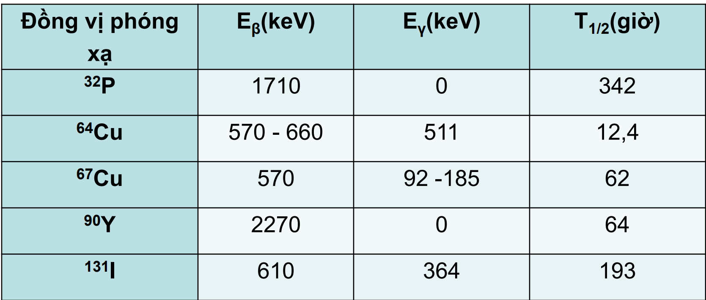

# 1911: Thí nghiệm tìm sự có mặt của hạt nhân (+) của Rutherford
 background-color:: red
	- ## Rutherford dùng tia α(+) bắn qua lá vàng dát mỏng để tìm sự có mặt của hạt nhân (+)
		- 
		- Nhận xét thí nghiệm:
			- Có các tia **xuyên** qua lá vàng => Nguyên tử **phần lớn** là các **khoảng không, không đặc**
			- Một số tia bậc lại một góc rất lớn: những hạt α phải va chạm với cái gì đó **rất nặng** và **đặc** và mang **cùng điện tích dương**
			- => Các hạt proton tập trung lại với nhau ở tâm nguyên tử
		- ## Mô hình nguyên tử Rutherford:
			- 
		- ## Độ bền của hạt nhân:
			- >1   $\leq$ $\frac{N}{P}$ $\leq$ 1.52
			  >+ N: số neutron
			  + P: số proton
			  
			  >#+BEGIN_TIP
			  (tỉ lệ $\frac{N}{P}$ càng lớn thì độ bền hạt nhân càng giảm, các bạn có thể dùng công thức này để giải thich lâm sàng Case 1 )
			  #+END_TIP
			- Hạt nhân có Z > 82 có tính phóng xạ
			- Do tỉ lệ P, N thay đổi, nhân ko bềnh tự hủy thành nguyên tố khác, đồng thời phát ra bức xạ α, β, γ
	- ## Khả năng xuyên thấu:
		- 
		- \
		- >#+BEGIN_IMPORTANT
		  Tia ${\beta}$ có quãng đường đi ngắn nên được dùng trong điều trị
		  Tia ${\gamma}$ có quãng đường đi dài nên được dùng trong chuẩn đoán
		  #+END_IMPORTANT
		- ### >+ Các tia **bức xạ** có thể **ảnh hưởng** đến **tất cả tế bào**
		  + **Nhiều nhất** là ở các tế bào **phân chia nhanh**(tế bào ung thư, tế bào tóc,...)
		- >#+BEGIN_TIP
		  Đó cũng là lí do mà các bệnh nhân ung thư sau khi chữa trị thì rụng tóc á :3
		  Đây cũng là câu hỏi mở thầy cô có thể hỏi trong case 1 nên các bạn chú ý nhaa :))
		  #+END_TIP
	- ## Ứng dụng đồng vị phóng xạ trong chẩn đoán và chữa trị bệnh:
		- 
	- ## **Xạ trị chuyển hóa** (đưa chất phóng xạ vào bên trong cơ thể)
		- Đồng vị lý tưởng: chỉ có **tia β** mà không có γ
		- ## >Lý do:
		  collapsed:: true
		  + Quãng đường đi ngắn: tia β chỉ đi vào mô 1 -> 2 mm
		  + Truyền 95% năng lượng trên quãng đường đi
			- >=> Tập trung vào mô đích và không ảnh hưởng các mô lân cận
		- 
			-
			- $E_{\beta}$: năng lượng tia lý tưởng
			- $E_{\gamma}$: Càng ít càng tốt. Nếu có phải có thêm  biện pháp bảo vệ
			- $T_{\frac{1}{2}}$: Càng ngắn càng thuận lợi, đỡ mất thời gian bảo vệ
			-
	- ## Cấu tạo vỏ Rutherford:
		- 
		- Electron quay quang proton
			- => Electron tạo ra bức xạ điện từ và mất năng lượng
				- => Electron sau khi hết năng lượng và đâm vào hạt nhân?
					- => Nguyên tử sẽ bị phá vỡ?
					  background-color:: red
-